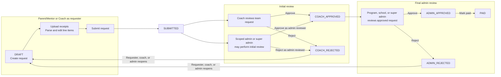

# User Capabilities

This document summarizes the capabilities implemented for each user type in the reimbursement workflow app. Access is cumulative: a signed-in user can have a global role, one or more scoped admin roles, and one or more approved team memberships.

## Reimbursement Flow By User Type

## Signed-Out Visitor

- Can view the public landing page.
- Can view the policy page.
- Can sign in or create a standard account.
- Can access authentication endpoints and static assets.
- Cannot access authenticated app pages or authenticated API routes.

## Signed-In User

A signed-in user has the global `USER` role by default. Without an approved team membership or scoped admin role, access is intentionally limited.

- Can view the dashboard.
- Can view and edit their profile.
- Can complete onboarding to join an existing team or request a new team registration.
- Can open the new request page, but cannot create a reimbursement request unless they choose a team where they have an approved membership.
- Can view their own request list, which may be empty.
- Is redirected to onboarding from team pages when they have no approved team membership.
- Cannot access coach review pages.
- Cannot access admin management pages.

## Parent/Mentor

A parent/mentor is a signed-in user with an approved `PARENT_MENTOR` team membership.

- Can view their team workspace and roster.
- Can create reimbursement request drafts for teams where they are an approved member.
- Can upload receipts to their own requests.
- Can use receipt parsing/autofill when configured.
- Can review and edit extracted line items while their request is still a draft.
- Can submit draft reimbursement requests for review.
- Can view their own requests.
- Can view requests for teams where they are an approved member.
- Can download PDFs for requests they own or can view through team membership.
- Can reopen requests that were rejected by a coach or admin when they own the request.
- Cannot approve or reject reimbursement requests.
- Cannot access admin management pages.

Visible desktop navbar links:

- My Team
- New Request
- My Requests
- Profile

## Coach

A coach is a signed-in user with an approved `COACH` team membership.

- Has team member access to assigned teams.
- Can view coach team overview pages.
- Can view the team reimbursement queue for assigned teams.
- Can create reimbursement requests for teams where they are an approved member.
- Can view requests for teams where they are an approved member.
- Can edit draft requests for assigned teams.
- Can edit and comment on line items while requests are in `SUBMITTED` status.
- Can approve or reject submitted requests at the coach review stage.
- Can reopen rejected requests for assigned teams.
- Can download PDFs for requests they can view through team membership.
- Is routed from the user request list to the coach reimbursement queue.
- Cannot perform final admin approval, rejection, or payment actions unless they also have an admin role.
- Cannot manage users, teams, or team registrations unless they also have an admin role.

Visible desktop navbar links:

- Team Overview
- Team Reimbursements
- New Request
- Profile

## Program Admin

A program admin is a signed-in user with a scoped `PROGRAM_ADMIN` assignment. Their admin capabilities apply only inside the assigned district, school, program, or team scope.

- Can view admin reimbursement queues for requests in their managed scope.
- Can view and manage reimbursement requests in their managed scope.
- Can take admin reimbursement actions in their managed scope.
- Can act at the initial review stage for scoped requests when needed; those actions are labeled as admin actions.
- Can edit and comment on line items for scoped requests according to workflow status.
- Can manage teams in their assigned program scope.
- Can review and decide team registration requests in their assigned program scope.
- Can use coach-style team overview and team reimbursement pages for teams in their managed scope.
- Can view request details through admin routes for scoped requests.
- Cannot manage users.
- Cannot assign admin scopes.
- Cannot promote users to or demote users from `SUPER_ADMIN`.
- Cannot create teams through the public teams API unless they also have super admin access.

Visible desktop navbar links:

- Admin Inbox
- Reimbursements
- Manage Teams
- Team Registrations
- Profile

## School Admin

A school admin is a signed-in user with a scoped `SCHOOL_ADMIN` assignment. Their admin capabilities apply only inside the assigned district, school, program, or team scope.

- Has program admin capabilities within their assigned school or district scope.
- Can manage users tied to their managed scope.
- Can assign `PROGRAM_ADMIN` scopes within schools they manage.
- Can manage teams in their assigned school or district scope.
- Can review and decide team registration requests in their assigned scope.
- Can manage reimbursement requests in their assigned scope.
- Can take coach-stage admin review actions when needed for requests in scope.
- Can use coach-style team overview and reimbursement pages for teams in scope.
- Cannot assign `SCHOOL_ADMIN` scopes unless they are also a super admin.
- Cannot promote users to or demote users from `SUPER_ADMIN`.

Visible desktop navbar links:

- Admin Inbox
- Reimbursements
- Manage Teams
- Team Registrations
- Manage Users
- Profile

## Super Admin

A super admin is a signed-in user with the global `SUPER_ADMIN` role.

- Can manage users across the platform.
- Can promote users to `SUPER_ADMIN` or demote them back to `USER`.
- Can assign `SCHOOL_ADMIN` scopes.
- Can manage all teams across all districts, schools, and programs.
- Can create teams through the teams API.
- Can list all teams without school or program filters.
- Can manage all team registration requests.
- Can manage all reimbursement requests.
- Can take final admin approval, rejection, and payment actions.
- Can act at the initial review stage when needed; those actions are labeled as admin actions.
- Can use admin request detail routes for all requests.
- Can use coach-style team overview and reimbursement pages across managed teams.
- Sees the platform-wide dashboard card for all districts.
- Is redirected away from onboarding because no team onboarding is required.

Visible desktop navbar links:

- Admin Inbox
- Reimbursements
- Manage Teams
- Team Registrations
- Manage Users
- Profile

## Combined Roles

- Capabilities are additive. For example, a school admin who is also a coach has both admin and coach capabilities.
- Navbar links are deduplicated when a user has multiple roles.
- Admin reimbursement access takes precedence for request detail links when the user can manage the target request.
- Scoped admin access is limited by the district, school, program, and team values on each scope assignment.
- Approved team memberships are required for parent/mentor and coach team-member capabilities.

## Mobile Navbar Behavior

On desktop widths, role-specific navbar links are visible directly in the top navbar. On mobile widths, the role-specific links are hidden behind the menu button until the menu is opened.
